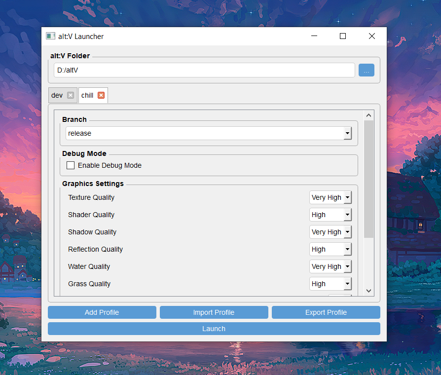

# alt:V Easy Launch

alt:V Easy Launch is a simple and powerful tool to manage and launch your alt:V client. With features like profile management, debug mode toggling, and graphical setting customization, this application streamlines the process of switching between different configurations and settings for alt:V.

## Key Features

- **Profile Management**: Easily create, import, export, and switch between different profiles for your alt:V settings.
- **Debug Mode**: Toggle Debug Mode to assist with testing and debugging during development.
- **Branch Selection**: Choose from different alt:V client branches (e.g., release, rc, dev) for different versions.
- **Graphics Settings Customization**: Fine-tune graphics settings such as texture quality, shadow quality, water quality, and more.
- **One-Click Launch**: Launch alt:V with a single click, using the selected profile and settings.
- **Remembered Paths**: The application remembers the paths to your alt:V folder and GTA V installation for easy reuse.
- **Multi-Environment Setup**: Switch between different environments or use cases (e.g., "dev" and "chill") with a simple tab interface.

## Installation

1. **Download the latest version** from the [Releases](https://github.com/str1xxxx/alt-V-Easy-Launch/releases) section.
2. **Extract the archive** to a folder of your choice.

## Usage

1. Launch the `altv_launcher.exe` application.
2. Set the path to your alt:V folder.
3. Configure a profile by selecting branch, debug mode, and graphic settings, or use an existing profile.
4. Click **Launch** to start the alt:V client with your selected settings.
5. Use **Add Profile** to save custom configurations or import/export profiles as needed.

## Profile Management

- **Add Profile**: Create new profiles with different configurations.
- **Import Profile**: Import profiles from files for quick setup.
- **Export Profile**: Save profiles to share or back them up.

## Building from Source

If you'd like to build this application from source, follow the steps below:

### Requirements

- Python 3.x
- PyQt5
- PyInstaller
- UPX (optional, for compression)

### Build Instructions

1. Clone the repository from GitHub.
2. Install the required dependencies.
3. Run the build script using PyInstaller to generate the executable.

## Contribution

Feel free to submit issues and pull requests on the [GitHub repository](https://github.com/str1xxxx/alt-V-Easy-Launch).
